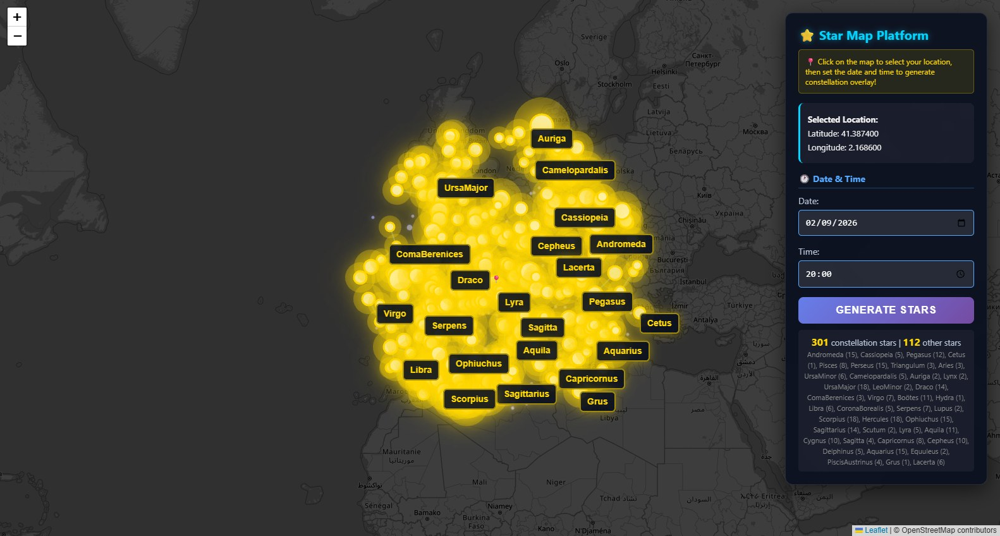
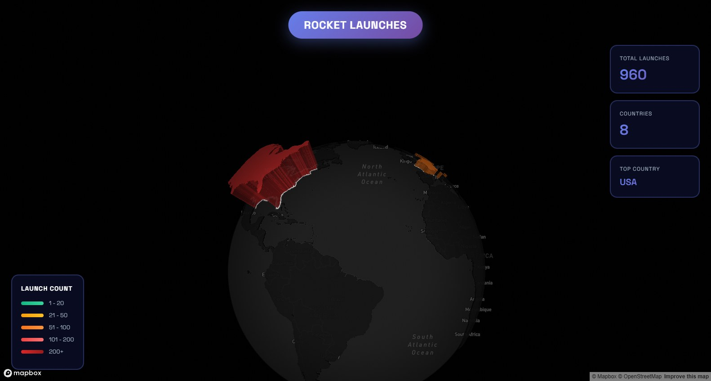
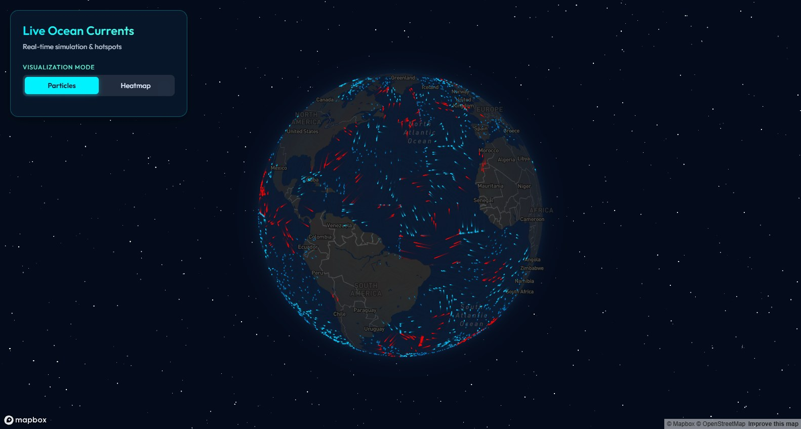

# 30 Day Mapping

A 30-day geospatial challenge: one small, self-contained mapping or data-visualisation
project per day. Each day lives in its own folder and runs on its own - no shared build
step, no monorepo tooling.

## Projects

| Day | Project | Stack | Run |
|-----|---------|-------|-----|
| 18 | [Star Constellation Map Platform](Day_18_Constellations/star_map_platform) - click any point on Earth, get the real sky above it for any date and time, with constellation lines and lore | Flask, Skyfield, Hipparcos catalogue, Leaflet | `python app.py` |
| 19 | [Global Rocket Launches 3D Globe](Day_19_Rocket%20launch) - countries extruded by launch count on a spinning satellite globe | Mapbox GL, deck.gl, D3 | static server |
| 20 | [Live Ocean Currents Globe](Day_20_Water) - ocean current particles and heatmap over a dark globe | Mapbox GL | static server |

More days get added as the challenge progresses.

## Screenshots

### Day 18 - Star Constellation Map Platform

Barcelona, 2 Sep 2026 20:00 - 301 constellation stars and 112 background stars plotted as an
azimuthal sky chart centred on the observer, zenith at the middle and horizon at the rim.
Labels are culled on collision, so the ones that survive stay readable and more appear as
you zoom in.



### Day 19 - Global Rocket Launches 3D Globe

960 launches across 8 countries, each country extruded and coloured by launch volume - the
USA dominates in deep red, Europe in orange.



### Day 20 - Live Ocean Currents Globe

Particle mode, animating live current velocities pulled from the Open-Meteo marine API across
a 10 degree global grid. Red streaks mark the fastest flows. Switch to Heatmap mode for a
density view with named hotspots like the Gulf Stream and Antarctic Circumpolar.



Both Mapbox projects need a valid access token in `config.js` before they draw anything.

## Running a project

### Static projects (Day 19, Day 20)

These fetch data over `fetch()`, so opening `index.html` from the filesystem trips CORS.
Serve the folder instead:

```bash
cd "Day_20_Water"
cp config.example.js config.js     # then paste your Mapbox token into config.js
python -m http.server 8000
# open http://localhost:8000
```

Day 19 and Day 20 both need that `config.js` step. It is gitignored, so your token stays
local; `config.example.js` is the committed template. Free tokens come from
<https://account.mapbox.com/access-tokens/>. Without it the page shows a "Missing Mapbox
token" notice instead of failing silently.

### Flask projects (Day 18)

```bash
cd Day_18_Constellations/star_map_platform
python -m venv .venv && .venv/Scripts/activate    # Windows
# source .venv/bin/activate                        # macOS / Linux
pip install -r requirements.txt
python app.py
# open http://localhost:5000
```

## Data files

Large astronomy and raster datasets are **not** committed - they are gitignored to keep
the repo cloneable. Day 18 needs two of them in `Day_18_Constellations/star_map_platform/data/`:

- `de421.bsp` (~16 MB) - JPL planetary ephemeris. Skyfield downloads it automatically on
  first run, or grab it from <https://naif.jpl.nasa.gov/pub/naif/generic_kernels/spk/planets/de421.bsp>
- `hip_main.dat` (~53 MB) - Hipparcos star catalogue, from
  <https://cdsarc.u-strasbg.fr/ftp/cats/I/239/hip_main.dat>

The smaller files that shape the projects (`constellationship.fab`, `constellation_info.json`,
the launch CSV) are committed.

## Repository layout

```
30_Day_Mapping/
├── Day_18_Constellations/
│   └── star_map_platform/     # Flask app, templates, static assets, data/
├── Day_19_Rocket launch/      # index.html, app.js, launch CSV, config.example.js
├── Day_20_Water/              # index.html, app.js, style.css, config.example.js
└── README.md
```

`30day/` is a local Python virtual environment and is gitignored.

## Notes

- Mapbox tokens live in a gitignored `config.js` per project, never in committed source.
  Public `pk.` tokens are designed to be shipped to the browser, but still scope them to
  your own domains in the Mapbox dashboard before deploying anywhere public.
- Each day folder is independent; delete or fork one without touching the rest.
